# 🚀 Project: StudentHub - Your University App! 📱

>  <h3>I’m excited to share my final year project, StudentHub - Your University App!, a mobile application designed to streamline the
>   university experience by bringing all essential resources into one platform. 🎓</h3>

 &nbsp;
 &nbsp;
 &nbsp;
 &nbsp;
  

## 🧠 Motivation behind Developing this Application
As a computer student, I have personally experienced the tension every student has before the night of the exam. Students  will be involved in gathering all the notes, and documents starting from PPTs to PDFs, etc. related to the Course. This app helps to solve the problem which helps them to keep all the notes in **one place** and allows every student to access it hassle-free.
Secondly, there is an issue that teachers and administration use different platforms for communication and most of us get fake news and information. This app also helps to solve the problem which helps them to keep all the messages/notifications/alerts in **one place** and allows every student to access authentic information.
  

## 🔍 Why this Project:
We do have alternatives like Google Drive, WhatsApp, Gmail, university website, etc but StudentHub merges multiple mobile services, allowing students to access in-app messages from teachers, manage notes, receive university notifications, and more—all from one place. The app includes features like location services, helplines, student ID cards, class and teacher contact lists, attendance monitoring, academic scores, timetables, fee tracking, and more. It's designed to cater to authentic users with secure login options, while general information remains accessible to everyone.
  

## 💻 Technologies Used:
- React Native
- React Native Paper
- Node.js
- Firebase
   - Authentication
   - Realtime Database
   - Storage
   - Cloud Messaging
  

## ✨ Key Features:
- In-app messaging
- Notes view and upload
- Comprehensive academic resource management
  

## 🚀 Looking Ahead:
I envision enhancing this app further by making it more secure and integrating AI features. Your feedback or suggestions for collaboration are most welcome! 🤝
  

## Screenshots 

<table>
 
 <tr>
   <td width="33.3%">&nbsp;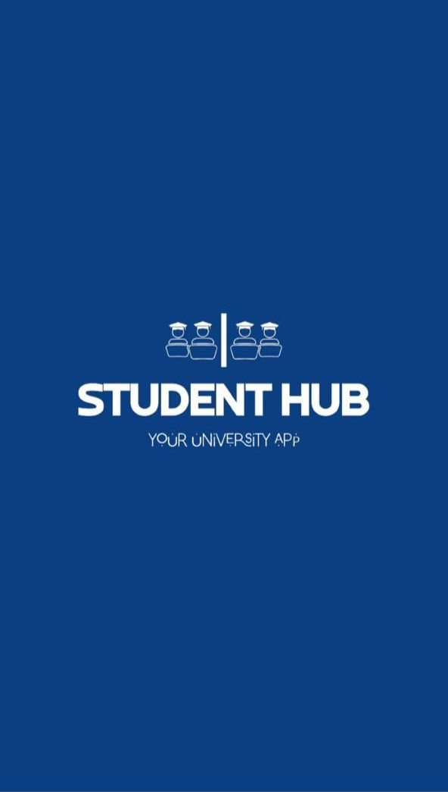</td>
   <td width="33.33%">&nbsp;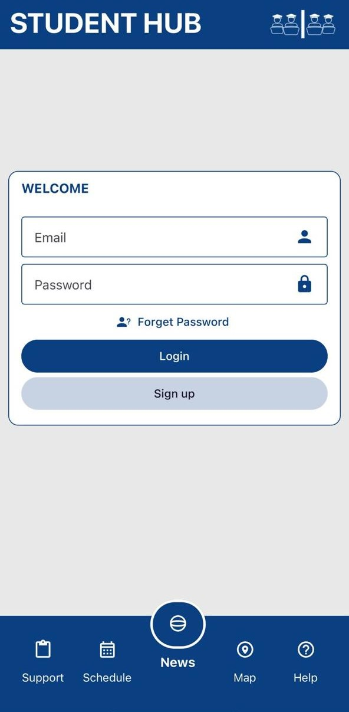</td>
   <td width="33.33%">&nbsp;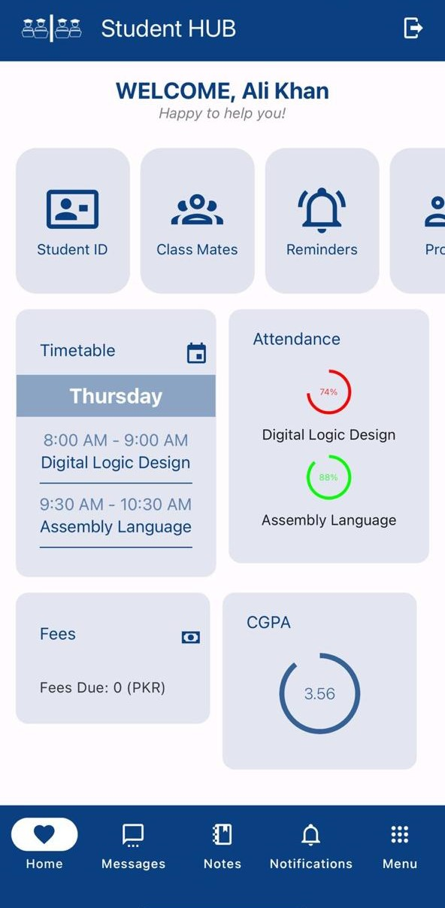</td>
 </tr>
 <tr>
   <td align="center">Splash Screen</td>
   <td align="center">Login Screen</td>
   <td align="center">Home Screen</td>
 </tr>
 
 <tr>
   <td width="33.3%">&nbsp;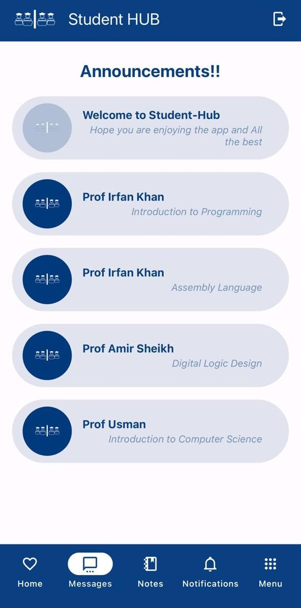</td>
   <td width="33.33%">&nbsp;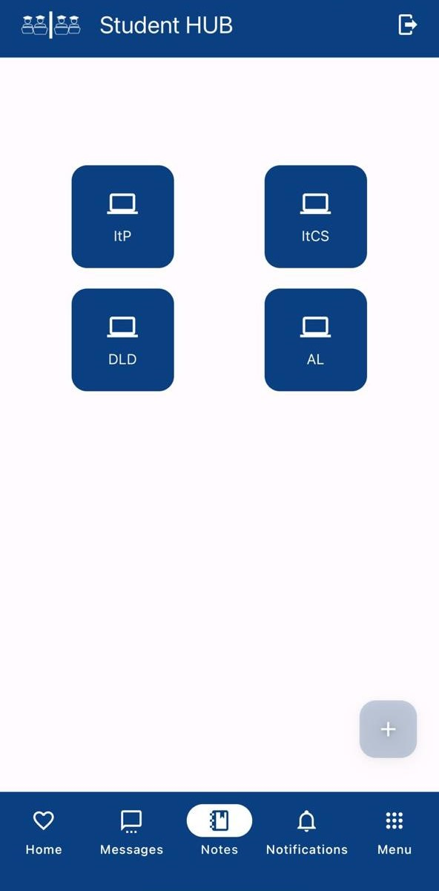</td>
   <td width="33.33%">&nbsp;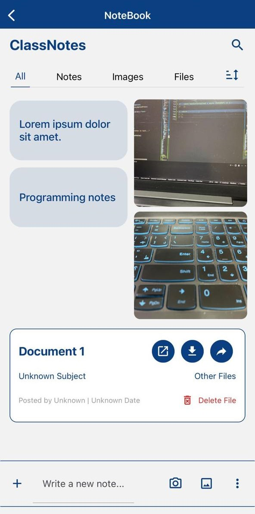</td>
 </tr>
 <tr>
   <td align="center">Announcements</td>
   <td align="center">Notes Menu</td>
   <td align="center">Notes</td>
 </tr>

 <tr>
   <td width="33.3%">&nbsp;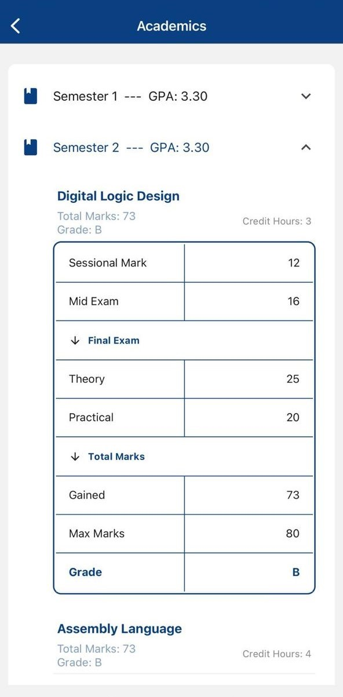</td>
   <td width="33.33%">&nbsp;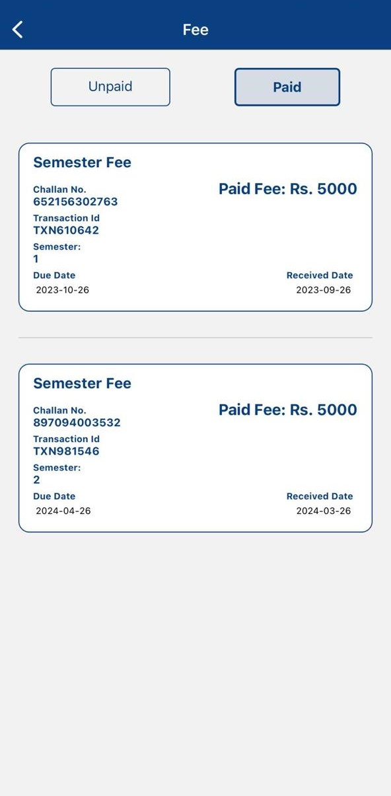</td>
   <td width="33.33%">&nbsp;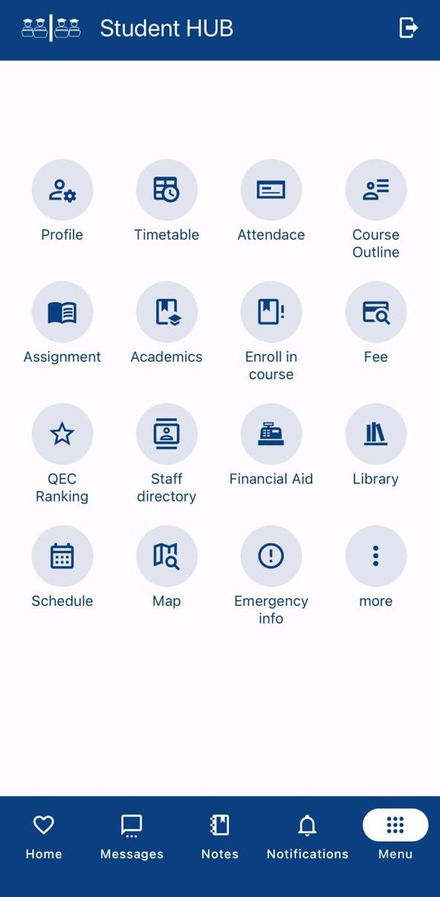</td>
 </tr>
 <tr>
   <td align="center">Academics</td>
   <td align="center">Fee</td>
   <td align="center">Menu/td>
 </tr>

 <tr>
   <td width="33.3%">&nbsp;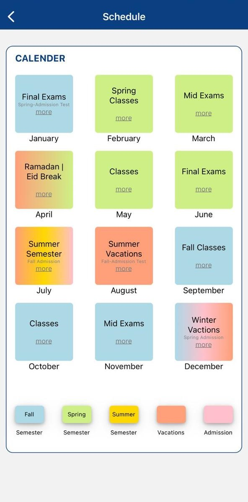</td>
   <td width="33.33%">&nbsp;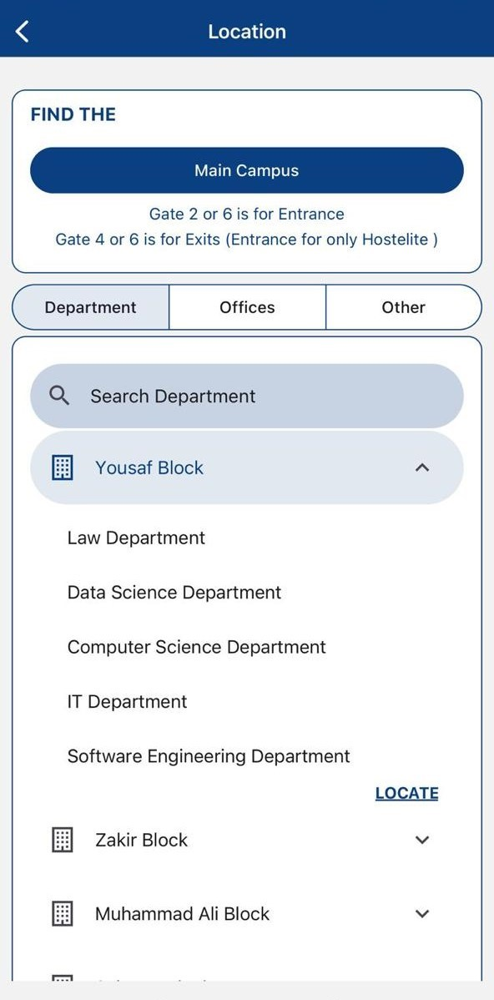</td>
   <td width="33.33%">&nbsp;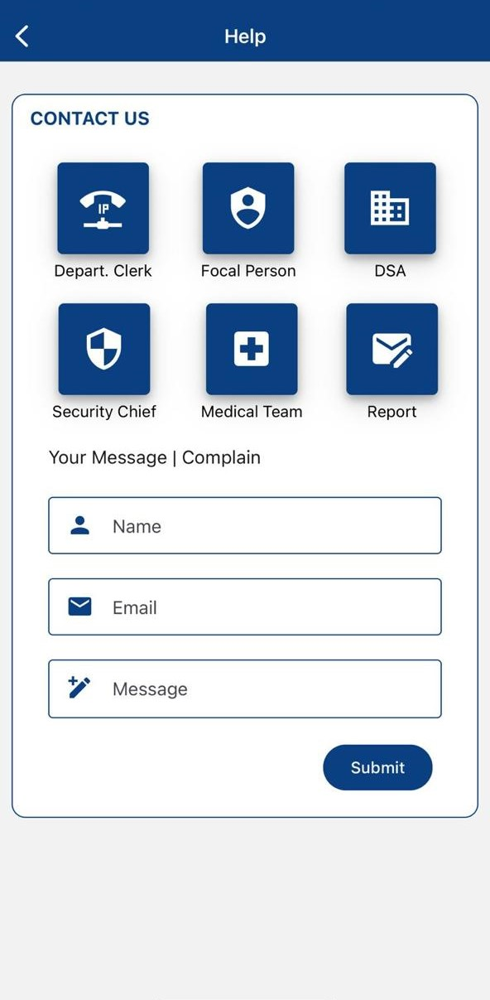</td>
 </tr>
 <tr>
   <td align="center">Schedule Screen</td>
   <td align="center">Location Screen</td>
   <td align="center">Help Screen</td>
 </tr>
  
</table>
